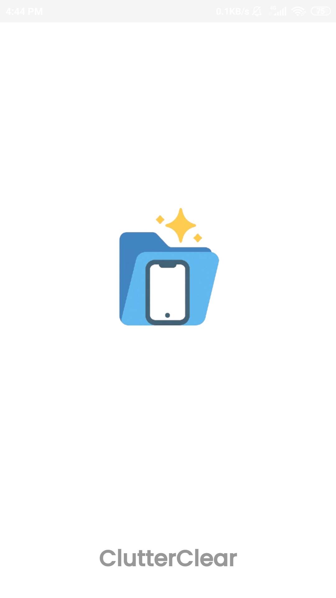
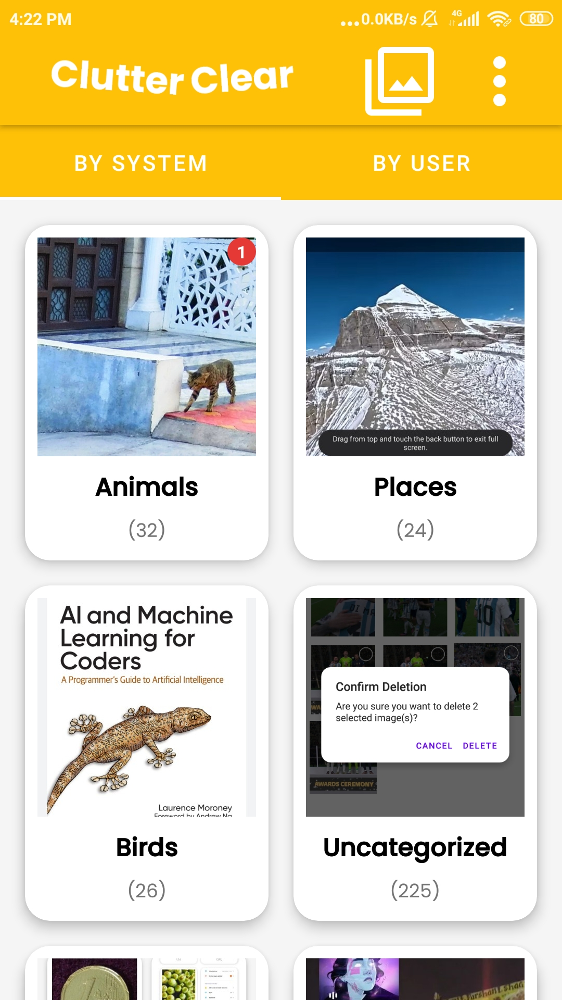
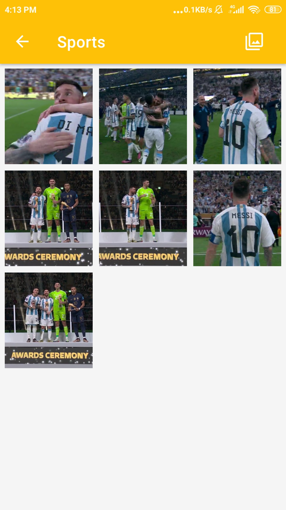
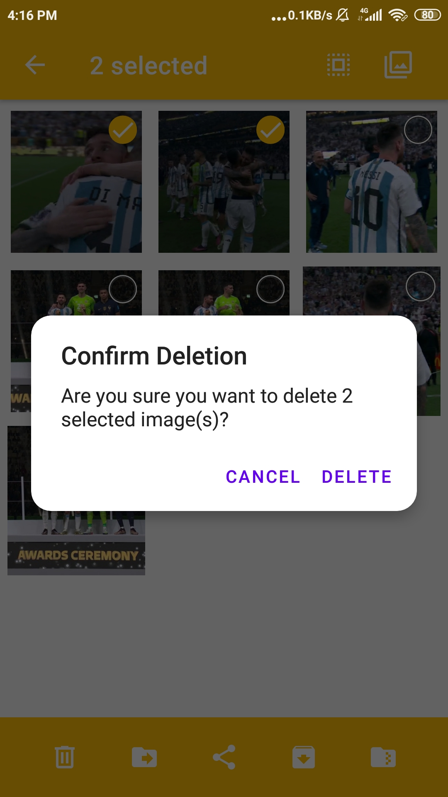
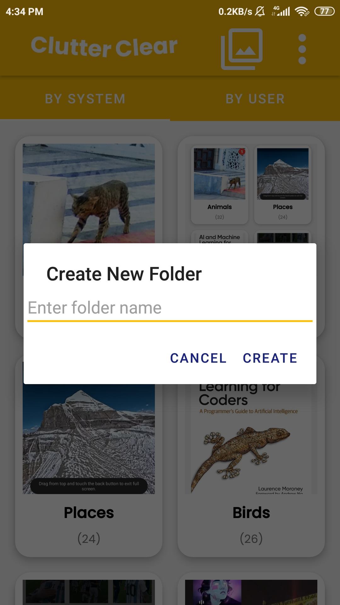
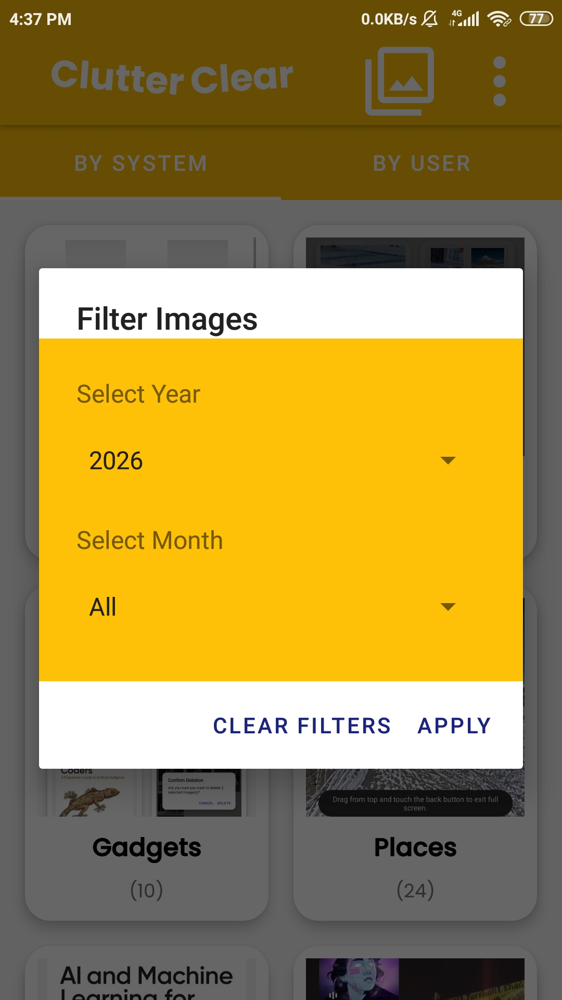
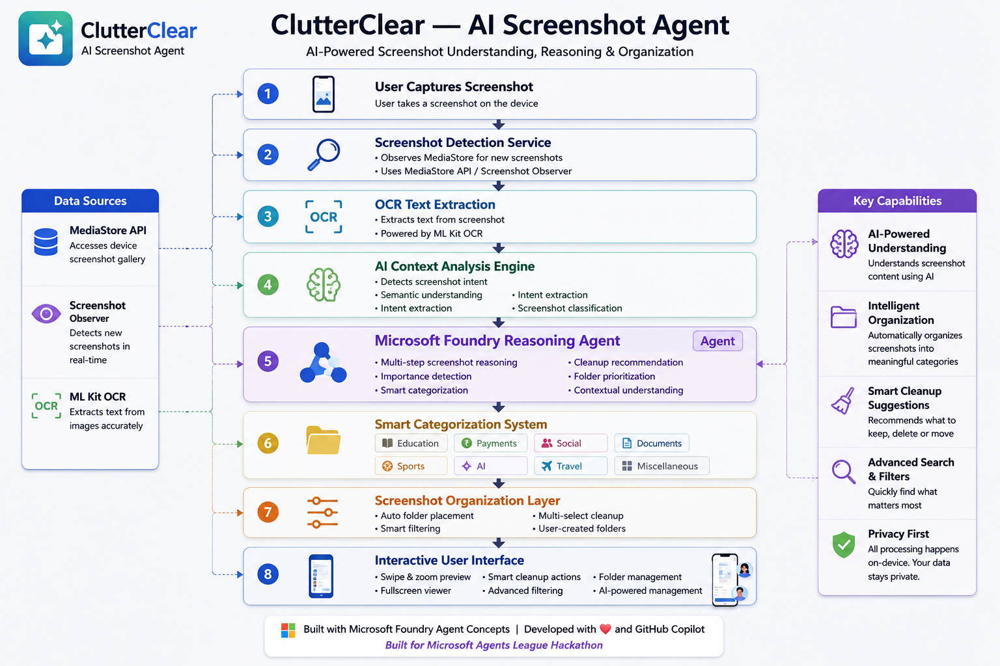

# ClutterClear — AI Screenshot Agent

ClutterClear is an AI-powered Android application that intelligently organizes screenshots using OCR, AI-powered reasoning and intelligent categorization, and smart cleanup suggestions.

The app helps users manage cluttered screenshot galleries by automatically analyzing screenshot content and grouping them into meaningful categories such as education, payments, documents, social media, and more.

---

## Features

- Automatic screenshot detection
- OCR-based text extraction
- AI-powered reasoning and screenshot categorization
- Smart folder organization
- Multi-select cleanup tools
- Swipe, zoom, and image preview support
- Intelligent screenshot management workflow

---

## How It Works

1. Detects newly captured screenshots
2. Extracts textual context using OCR
3. Analyzes screenshot content
4. Performs multi-step reasoning on screenshot context
5. Categorizes screenshots intelligently
6. Suggests organization and cleanup actions

---

## AI Capabilities

- OCR-based screenshot understanding
- Context-aware screenshot reasoning
- Intelligent categorization workflow
- Multi-step content analysis
- Smart organization suggestions
- Cleanup recommendation system

---

## Tech Stack

- Android (Java/Kotlin)
- ML Kit OCR
- WorkManager
- MediaStore API
- Custom image preview system
- Microsoft Foundry Agent Architecture
- GitHub Copilot Assisted Development

---

## Microsoft AI Integration

ClutterClear uses OCR and AI-powered reasoning workflows to intelligently understand screenshot context and automate screenshot organization.

The architecture is designed around Microsoft Foundry Agent concepts, enabling:
- multi-step screenshot reasoning
- contextual understanding
- intelligent categorization
- cleanup recommendations
- smart organization workflows

GitHub Copilot was also used during development to accelerate coding, debugging, and workflow improvements.

---

## Vision

ClutterClear aims to become an intelligent screenshot reasoning agent that helps users reduce digital clutter and quickly find important information from thousands of screenshots.

---

## Hackathon Challenge

This project is being developed for the Microsoft Agents League Contest under the "Reasoning Agents" challenge category.

---

# App Screenshots

## Splash Screen

## Main Dashboard

## Sports Category View

## Multi-Select Delete System

## Create Custom Folder

## Smart Filter Dialog

## Architecture Diagram

